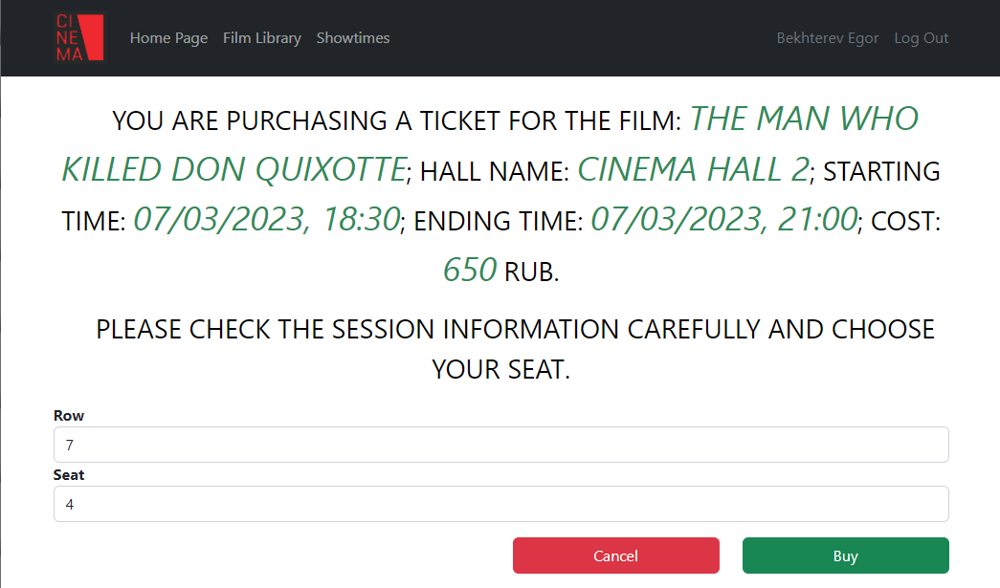

# job4j_cinema

## Описание проекта

* Web-приложение, представляющее собой сайт кинотеатра.
* Добавлена кинотека для получения информации о демонстрируемых фильмах.
* На странице Showtimes можно ознакомиться со списком киносеансов и приобрести билет.
* Реализована авторизация и аутентификация пользователей сервиса.

## Стек технологий

- **Java 17.0.2**
- **Spring Boot 2.7.6**
- **Thymeleaf**
- **Bootstrap 5.2.3**
- **HTML5**
- **PostgreSQL 15**
- **Liquibase 4.15.0**
- **SQL2o 1.6.0**
- **H2DB 2.1.214**
- **Commons-dbcp2 2.9.0**
- **Junit 5.8.2**
- **Mockito 3.5.13**
- **Maven 3.8.1**

## Требования к окружению

- **Java 17.0.2**
- **Maven 3.8.1**
- **PostgresSQL 15**

## Сборка и запуск

- **Создать БД**

``` 
create database cinema;
```

- **Запустить проект по команде**

``` 
mvn spring-boot:run -Pproduction
```

- **Перейти в браузере по ссылке**

``` 
http://localhost:8080/
```

## Взаимодействие с приложением

### Главная страница. Отображает общую информацию о ресурсе.


### Кинотека. Содержит информацию о фильмах.


### Расписание киносеансов. Отображает информацию о грядущих киносеансах. Для покупки билета нужно авторизоваться.


### Страница регистрации пользователя. 


### Если пользователь создает аккаунт с уже зарегистрированным ранее email'ом, отображается страница с ошибкой.


### Страница аутентификации пользователя.


### При вводе некорректных данных отображается форма с ошибкой.


### Страница покупки билета. Отображает информацию о сеансе, позволяет выбрать ряд и место.


### Страница с сообщением об успешной покупке билета.


### Если место уже кем-то занято, отображается страница с результатом неудачной покупки билета.


### При открытии страницы несуществующего киносеанса появляется сообщение об ошибке.


## Контакты для связи
telegram: <a href="https://t.me/bekhterev_egor" target="blank">@bekhterev_egor</a>
